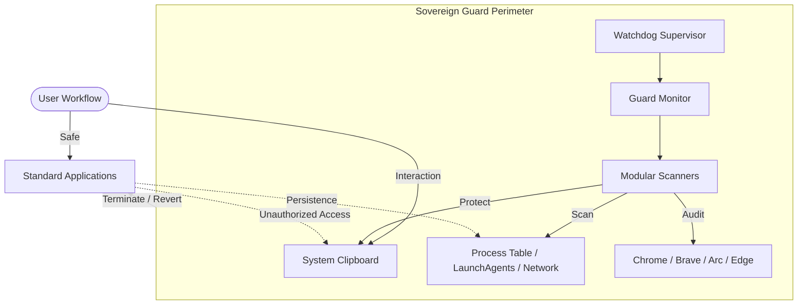

# 🛡️ Sovereign Guard Suite (2026 Enterprise Edition)

**"Your hardware is secure, but is your session?"**

Sovereign Guard is a high-fidelity, zero-trust security perimeter designed to protect modern workstations against the 2026 threat landscape. While 2024-era protections like **Device Bound Session Credentials (DBSC)** secured cookies to hardware, they left a massive blind spot: **Local Environment Exploitation.**

Sovereign Guard fills that gap by policing the *execution context* rather than just the *credential*.

---

## 🏗️ System Architecture

Sovereign Guard operates as a multi-layered defensive shell around your sensitive applications.



---

## 🧩 The 2026 Threat Landscape

In 2026, account hijacking has evolved beyond simple cookie theft. Attackers now leverage:

1.  **"Inside-Out" Bypasses**: Malware launching legitimate browsers with `--remote-debugging-port` to clone user sessions remotely, bypassing hardware-bound cookies.
2.  **Smart Clippers**: Highly optimized "Click-Fix" scripts that swap crypto addresses or sensitive secrets in the milliseconds between Copy and Paste.
3.  **Shadow Persistence**: Malicious Service Workers and Hosted App Data that "haunt" your browser folders long after you leave a site.

Sovereign Guard neutralizes these threats instantly through **Real-Time Context Forensic Analysis.**

---

## 🛡️ Key Features

### Active Defense
-   **Anti-Hijack Sentry**: Instantly terminates browsers launched via unauthorized scripts or with hidden debug flags.
-   **Clipboard Fortress**: Reverts "Click-Fix" address swaps and sanitizes malicious command injections (e.g., hidden `curl | sh` pipes).
-   **Ghost Monitor**: Scans the `Service Worker` and `Local Storage` depths of your browser to detect hidden backdoors. Total support for **Arc, Brave, Chrome, and Edge.**
-   **Infostealer Forensic**: Deep-scans browser history to detect known infosteraler gateways and malicious landing pages before they exfiltrate data.

### Intelligence & Forensic
-   **7-Day Learning Phase**: Builds a personalized "Trusted Baseline" of your specific behavior.
-   **Agentic Forensic Reporting**: Whenever a threat is blocked, a local AI-powered report (via Ollama) explains exactly *what* happened and *why* it was blocked.
-   **Supply Chain Sentinel**: Watches your developer environment for typosquatting packages and suspicious `venv` modifications.

---

## ✅ Verification & Trust

Sovereign Guard is **Audit-Proven.** In the January 2026 E2E Security Audit, the system maintained a 100% success rate against active exploitation attempts:

| Attack Vector | Guard Response | Result |
| :--- | :--- | :--- |
| **Debug Hijack** | Browser Termination | ✅ BLOCK |
| **Pastejacking** | Buffer Sanitation | ✅ CLEAN |
| **Crypto Clipper** | Address Restoration | ✅ PROTECT |
| **Reverse Shell** | Connection Severed | ✅ KILL |
| **Shadow Persistence**| Entry Purged | ✅ CLEAN |

> [!IMPORTANT]
> This suite uses **Source Redaction** to protect proprietary threat intelligence. While the logic is open-source (The "Glass"), the specific signature lists (The "Moat") are redacted in the public repository to prevent bypass discovery.

---

## 🚀 Quick Start

**1. Install & Setup**
```bash
./setup.sh
```

**2. Bootstrap (Skip Learning)**
Instantly scan your current environment to build a safety baseline:
```bash
./sovereign bootstrap
```

**3. Check Status**
```bash
./sovereign status
```

---

## ⌨️ Command Center

| Command | Description |
| :--- | :--- |
| `./sovereign start` | Launch the active monitor supervisor |
| `./sovereign status` | View Trust Score, Mode, and Health |
| `./sovereign logs` | View real-time security alerts |
| `./sovereign scan` | Run a deep forensic audit of the OS |
| `./sovereign dev` | Enter "Safe Mode" (Alerts only, no Killing) |

**Stay Sovereign.**
